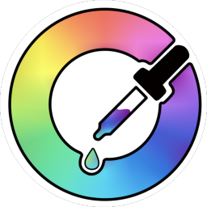

# MTI (Meta Theme Injector)

 

Meta Theme Injector is an extension that let you customize the theme-color meta tag on websites.

Most of websites still don't have the meta tag for change the color of UI of browser like address bar and the status bar on Android.
Some source of theme-color meta tag  [Link1](https://developers.google.com/web/updates/2015/08/using-manifest-to-set-sitewide-theme-color) [Link2](https://developers.google.com/web/updates/2014/11/Support-for-theme-color-in-Chrome-39-for-Android)

MTI can be used on browsers that supports extensions like [Kiwi Browser](https://kiwibrowser.com/)

Download latest version (mti.zip) -> [Releases](https://github.com/d3ward/mti/releases)

## Preview 

## Features

- Enable/disable MTI on website
- Auto detect color from website
- Keep the theme-color updated on scroll
- Edit default color
- Input a custom color with simple sliders or just input the hex value
- Import/Export
(<b>Rememeber : after any option changed you need to save </b>)

## Contributing

If you have a suggestion feel free to share it by opening an issue

## License
MTI is licensed under [(CC BY-NC-SA 4.0)](https://creativecommons.org/licenses/by-nc-sa/4.0/)

This project includes [Heroicons](https://heroicons.dev/) licensed under [MTI](https://github.com/tailwindlabs/heroicons/blob/master/LICENSE)
